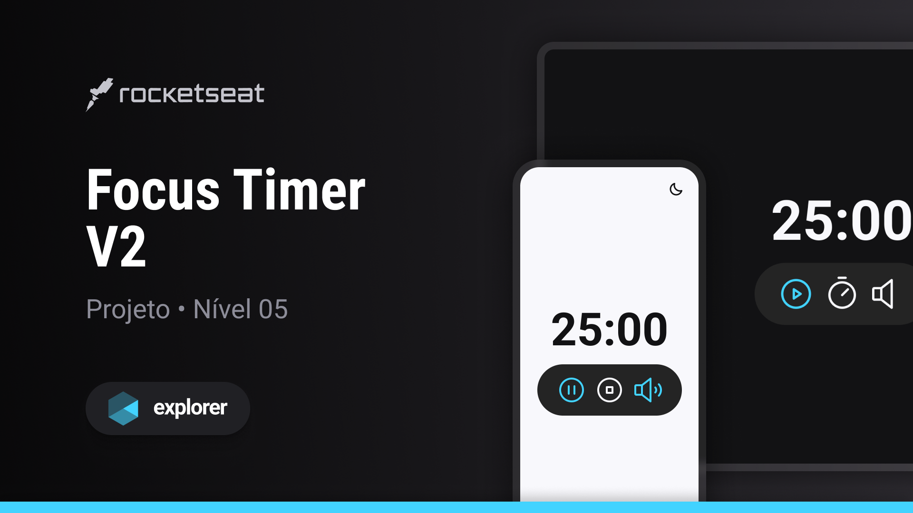

<h1 align="center"> Projeto FocusTimer </h1>

Programa exclusivo e gratuito, promovido pela Rocketseat para ensino de tecnologias WEB.

  <a href="#-tecnologias">Tecnologias</a>&nbsp;&nbsp;&nbsp;|&nbsp;&nbsp;&nbsp;
  <a href="#-projeto">Projeto</a>&nbsp;&nbsp;&nbsp;|&nbsp;&nbsp;&nbsp;
  <a href="#-layout">Layout</a>&nbsp;&nbsp;&nbsp;|&nbsp;&nbsp;&nbsp;
  <a href="#memo-licença">Licença</a>

  

 

## 🚀 Tecnologias

Esse projeto foi desenvolvido com as seguintes tecnologias:

- HTML e CSS
- JavaScript
- Git e Github
- Figma

## 💻 Projeto

O FocusTumer é um Timer desenvolvido em Javascript com possibilidade de alternar entre dark/light mode e música de fundo.
 
Esse projeto é desenvolvido na trilha Explorer da Rocketseat, a formação completa para sair do zero e conquistar sua primeira vaga em programação.

Você pode visualizar o projeto através [DESSE LINK](https://gbenini.github.io/imc-project/) 👀

## 🔖 Layout

Você pode visualizar o layout do projeto através [DESSE LINK](https://www.figma.com/file/vUj1NciqPJgVyXDPAiZu8I/Focus-Timer-V2-%E2%80%A2-Projeto-Explorer-(Community)?type=design&node-id=1422-28&mode=design&t=FlryPj1nbKqdnNp2-0). É necessário ter conta no [Figma](https://figma.com) para acessá-lo.

## :memo: Licença

Esse projeto está sob a licença MIT.

---

Feito com ♥ by GBenini e Rocketseat :wave: [Participe da nossa comunidade!](https://discord.gg/rocketseat)